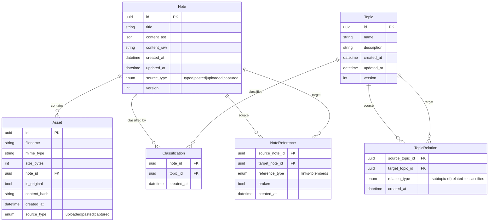
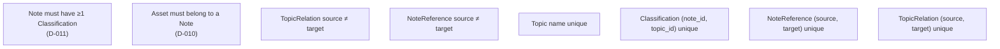
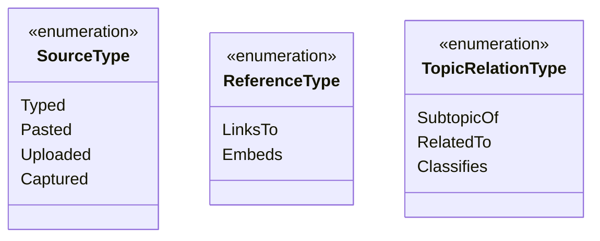

# Data Model — Mermaid ER Diagram

> Task artifact for [1.1_design-data-model.md](../1.1_design-data-model.md)

## Entity Relationship Diagram

## Constraints

## Enums

## Storage File Mapping

| Entity | Storage location | Format |
|--------|-----------------|--------|
| Note (content) | `notes/{id}/content.md` | Markdown (raw) |
| Note (AST) | embedded in `meta.json` or separate `content.ast.json` | JSON (AST) |
| Note (metadata) | `notes/{id}/meta.json` | JSON |
| Asset (file) | `notes/{id}/assets/{filename}` | Binary |
| Asset (metadata) | inside `notes/{id}/meta.json` | JSON |
| Topic | `topics/topics.json` | JSON |
| Classification | `index/classifications.json` | JSON |
| NoteReference | `index/references.json` | JSON |
| TopicRelation | `index/relations.json` | JSON |
| Config | `config.json` | JSON |

## Notes

- **Status:** Finalized
- **Version field:** On Note and Topic for sync conflict detection (D-006)
- **content_hash:** On Asset for future content addressing (D-002)
- **broken:** On NoteReference for detecting stale links (D-009, NFR-4.3)
- **content_ast:** Stored as opaque JSON (`serde_json::Value`) in Phase 1; real mdast evaluation deferred to Phase 2 task 2.1
