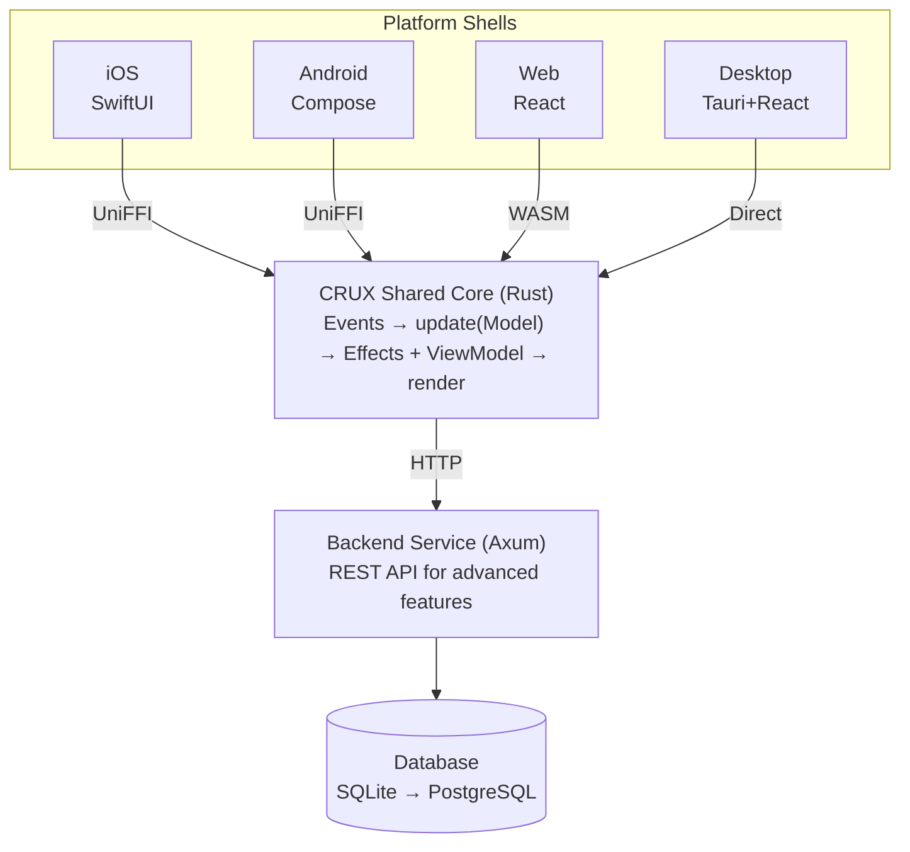
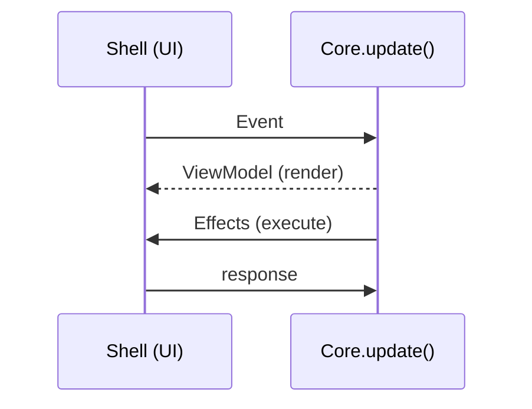

# Architecture

My Little Mind Map architecture

## Overview

Cross-platform

## CRUX Pattern

The shared core follows the Elm architecture:

1. **Event** — User interactions or system events sent from the shell
2. **Model** — Application state, owned by the core
3. **update()** — Pure function: `(Event, &mut Model) → Effects`
4. **ViewModel** — Serializable view data sent to the shell for rendering
5. **Capabilities** — Side effects (HTTP, storage, render) requested by the core

## Data Flow

