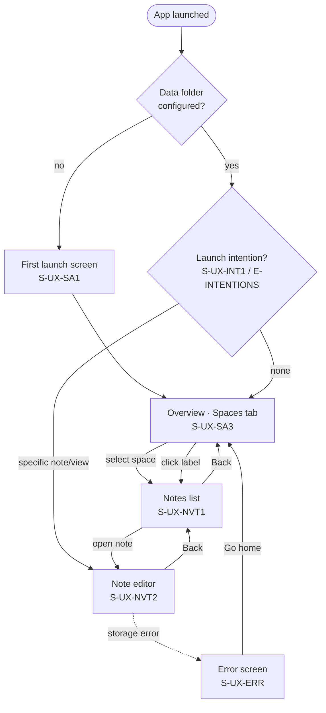
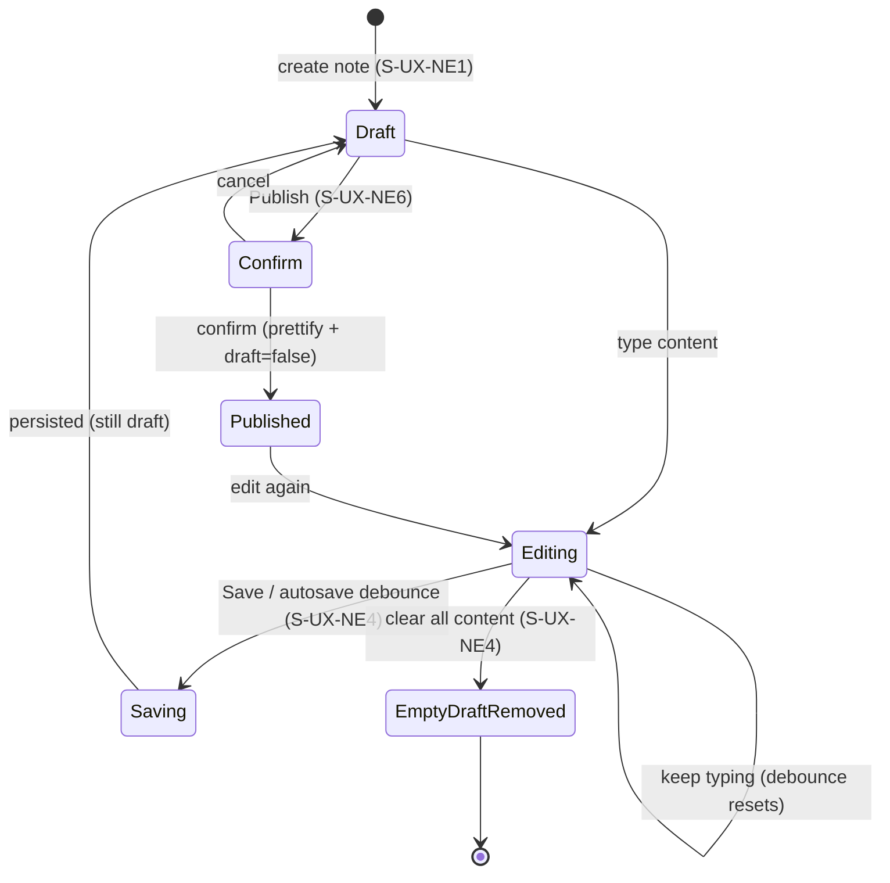

# UX Expectations

Detailed UX expectations for [E-UX](../expectations.md) ("Minimalistic, intuitive, responsive UI/UX"). This document refines `E-UX` into themed `E-UX-*` sub-codes and captures **screen wireframes** and **user flows** that illustrate the intended experience.

These wireframes and flows are **illustrative expectations**, not authoritative specifications. The authoritative, codified UX behaviour lives in the [UX spec](../specs/ux.md) (`S-UX-*`). Where a sketch and a spec disagree, the spec wins. Wireframes and flows here are inferred from the current shell implementations (`product/desktop-app/`, `product/web-app/`) and the shared E2E scenarios (`product/e2e-shared/scenarios/`); they do not by themselves define test cases.

Status legend (as in [expectations](../expectations.md)): **In-POC** — expected within the POC; **Deferred** — out of scope for the POC.

## Sub-Expectations

These sub-codes sit under [E-UX](../expectations.md) and are satisfied by `S-UX-*` specs in the [UX spec](../specs/ux.md).

- [E-UX-FEEDBACK] **Visual feedback and affordances.** Every user action produces timely, visible feedback. Transient and persistent states (unsaved changes, draft, saving/saved, filtering active, loading, errors) are surfaced through clear indicators; interactive elements look interactive. Users are never left guessing whether an action took effect. *In-POC.*
- [E-UX-CONSISTENCY] **Cross-platform UX consistency.** The same conceptual experience — screen structure, navigation model, terminology, and interaction patterns — is presented across desktop, web, and mobile shells, deviating only where platform conventions or constraints require (e.g. no folder picker on web). This refines [E-CROSS-PLATFORM](../expectations.md) at the UX surface. *In-POC.*
- [E-UX-NAV] **Navigation and information architecture.** A predictable, shallow information architecture: a persistent app frame with primary navigation (spaces, labels, notes views, recent, search), breadcrumbs and back/forward, and context-based content. Users always know where they are and how to get home. *In-POC.*
- [E-UX-INPUT] **Input and interaction.** Natural, low-friction input across modalities: keyboard-first interaction (shortcuts, Enter/Esc, in-content editor commands), pointer, and touch. Inline editor commands (e.g. `/:labels …;`) let users act without leaving the keyboard. This refines [E-MINIMAL-ACTIONS](../expectations.md). *In-POC.*
- [E-UX-THEME] **Theming and appearance.** A clean, modern visual theme with light and dark appearances. Theming is consistent across screens and respects the platform/system appearance where available. This concern is **visual appearance only**; viewport/orientation **layout adaptation** is owned by [E-RESPONSIVE](../expectations.md) (in-POC). *Deferred (POC ships a single dark theme; light theme and system-appearance following are post-POC).*

## Screen Wireframes

Lo-fi wireMD sketches of each screen, derived from the current shells. Annotations in parentheses reference the governing `S-UX-*` spec.

### First launch (`S-UX-SA1`)

Desktop/mobile — choose or create a data folder:

```wireMD
+--------------------------------------------------+
|                                                  |
|             # My Little Mind Map                 |
|                                                  |
|   Choose a folder where your notes will be       |
|   stored locally.                                |
|                                                  |
|        [ Choose Data Folder… ]   (primary)       |
|        [ Use Default (~/MyLittleMindMapData) ]   |
|                                                  |
+--------------------------------------------------+
```

Web — no filesystem access, single entry action (`S-UX-SA1` platform exception, `S-CFG-1`):

```wireMD
+--------------------------------------------------+
|             # My Little Mind Map                 |
|   Your notes are stored in this browser's        |
|   local storage.                                 |
|                                                  |
|              [ Get Started ]   (primary)         |
+--------------------------------------------------+
```

### Overview (`S-UX-MF1`, `S-UX-MF3`)

Persistent app frame: left sidebar with primary navigation + footer status; main content driven by the active tab (`E-UX-NAV`).

```wireMD
+-------------+------------------------------------+
| Mind Map    |  Spaces                 [+ New ]   |  <- tab header + action
|             |  -------------------------------   |
| ( Spaces )  |  ( banner: error )  (E-UX-FEEDBACK)|
| ( Labels )  |  +------------------------------+  |
| ( Views  )  |  | My                       [✕] |  |  <- space card (S-UX-ST2)
| ( Recent )  |  | 3 notes  #rust #notes        |  |
| ( Search )  |  +------------------------------+  |
|             |  +------------------------------+  |
|             |  | work                     [✕] |  |
|             |  | Work notes   2 notes         |  |
|             |  +------------------------------+  |
| ----------- |                                    |
| ~/MindMap   |  (footer = data folder path,       |
|             |   S-UX-MF1 status bar)             |
+-------------+------------------------------------+
```

Tabs share the frame; content area swaps. The Spaces tab can present spaces either as cards (above) or as a navigable tree (`S-UX-ST1`):

```wireMD
| ( Spaces )  |  Spaces                 [+ New ]   |
|             |  ________________________ (search) |  (S-UX-ST1)
|             |  v My                    3  [✕]    |  <- expanded node
|             |    - getting-started               |
|             |    > work                2         |  <- collapsed child space
|             |  > personal              5         |
```

- **Labels** (`S-UX-LT1`, `S-UX-LT2`): searchable list of labels in use, each a clickable chip with note count → opens cross-space filtered notes view.

```wireMD
| ( Labels )  |  Labels                            |
|             |  ________________________ (search) |  (S-UX-LT1)
|             |  [#rust 4]  [#notes 3]  [#python 2]|  <- chips w/ counts (S-UX-LT2)
|             |  [#learning 2]  [#draft 1]         |
```

- **Views** (`S-UX-NVT1`): list of saved views.

```wireMD
| ( Views )   |  Saved views                       |
|             |  +------------------------------+  |
|             |  | #rust in work                |  |  <- saved filter (S-DM-V1)
|             |  | spaces: work · labels: #rust |  |
|             |  +------------------------------+  |
|             |  | recent python                |  |
|             |  +------------------------------+  |
```

- **Recent / Search** (`S-UX-MF1`): placeholders in POC ("Coming soon").

### Empty states (`S-UX-FB5`)

Lists and content areas show guidance + a call-to-action instead of a blank pane:

```wireMD
+-------------+------------------------------------+
| ( Spaces )  |  Notes                  [+ New ]   |
|             |  -------------------------------   |
|             |          No notes yet              |  (S-UX-FB5)
|             |     Create your first note.        |
|             |        [ + New note ]   (primary)  |
+-------------+------------------------------------+
```

Labels empty: "No labels yet — add labels in the editor with `/:labels …;`". Views empty: "No saved views yet".

### Narrow viewport (`S-UX-MF2`)

Below the 640px breakpoint the sidebar collapses behind a menu toggle and the editor metadata panel stacks above the content:

```wireMD
+--------------------------------------+
| [☰]  Spaces              [ + New ]   |  <- menu toggle reveals nav overlay
+--------------------------------------+
| +----------------------------------+ |
| | My                  3 notes  [✕] | |
| +----------------------------------+ |
| +----------------------------------+ |
| | work                2 notes  [✕] | |
| +----------------------------------+ |
+--------------------------------------+
```

In the editor at narrow width, the metadata panel (`S-UX-NE1`) stacks above the markdown pane and MAY omit `uuid`, `created_at`, `updated_at` (available in the expanded view).

### Notes list (`S-UX-NVT1`)

```wireMD
+-------------+------------------------------------+
| [← Back]    |  Notes                  [+ New ]   |
|             |  ________________________ (search) |  (S-UX-NVT1)
| # work      |  +------------------------------+  |
|             |  | rust-intro        [Draft]    |  |  (E-UX-FEEDBACK)
| View: #rust |  | A short intro…               |  |
|       [✕]   |  | 2025-06-01   #rust #learning  |  |
|             |  +------------------------------+  |
| (active     |  +------------------------------+  |
|  view       |  | python-basics                |  |
|  badge,     |  | 2025-05-30   #python          |  |
|  S-DM-V1)   |  +------------------------------+  |
+-------------+------------------------------------+
```

### Note editor (`S-UX-NVT2`, `S-UX-NE1`–`S-UX-NE6`)

Toolbar with state badges + actions; markdown editor pane; right metadata panel.

```wireMD
+--------------------------------------------------+
| [← Back]  rust-intro     [Unsaved][Draft]        |  <- toolbar (E-UX-FEEDBACK)
|                          [Save][Publish][Delete] |  <- actions (S-UX-NE3)
+----------------------------------+---------------+
|                                  | rust-intro    |  <- metadata (S-UX-NE1)
|  # Rust intro                    |               |
|                                  | Labels        |
|  Body text…                      | [#rust ✕]     |
|                                  | [#learning ✕] |
|  Tip: /:labels tag1 tag2;        | ___ (add)     |  (S-UX-NE2 / E-UX-INPUT)
|  (editor command, E-UX-INPUT)    |               |
|                                  | Note ID       |
|                                  | <uuid>        |
|       (markdown editor,          | 2025-06-01    |  <- created/updated
|        S-UX-NE2/NE5)             | 2025-06-02    |
+----------------------------------+---------------+
```

Publish confirmation overlay (`S-UX-NE6`):

```wireMD
        +--------------------------------------+
        | Publish this note? Formatting will   |
        | be applied to the content.           |
        |        [ Publish ]   [ Cancel ]      |
        +--------------------------------------+
```

Platform note (`S-UX-NE1`, [E-UX-CONSISTENCY]): narrow viewports MAY hide `uuid`, `created_at`, `updated_at` from the panel; they remain available in the expanded view.

### Error screen (`S-UX-ERR`)

```wireMD
+--------------------------------------------------+
|                  ⚠  Something went wrong          |
|                                                  |
|  <human-readable message: what failed and why>   |  (E-UX-FEEDBACK)
|                                                  |
|        [ Go home ]      [ Retry ]                |  (S-UX-ERR recovery)
+--------------------------------------------------+
```

## User Flows

Flows inferred from the shared E2E scenarios (`product/e2e-shared/scenarios/`). They illustrate navigation and state transitions; they are not test definitions.

### App navigation (`S-UX-NAV`, `S-UX-SA*`, `E-INTENTIONS`)



### Note editing lifecycle (`S-UX-NE3`, `S-UX-NE4`, `S-UX-NE6`)


